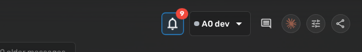
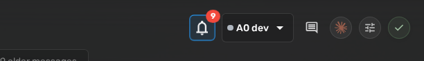
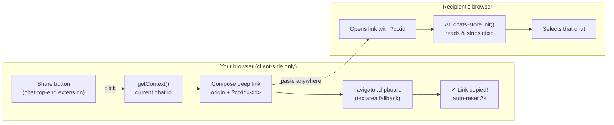

# Share Chat — Agent Zero Plugin

<!-- BADGES:START (generated by the devkit — `make badges`) -->

[](https://github.com/agent-zero-plugins/agent-zero-plugin-share-chat/actions/workflows/plugin-e2e.yml) [](https://github.com/agent-zero-plugins/agent-zero-plugin-share-chat/tree/main/tests/e2e/features) [](https://github.com/agent-zero-plugins/agent-zero-plugin-share-chat/tags) [](https://github.com/agent-zero-plugins/agent-zero-plugin-share-chat/blob/main/LICENSE) [](https://github.com/agent-zero-plugins/agent-zero-plugin-share-chat/blob/main/CONTRIBUTING.md)

<!-- BADGES:END -->

[](https://github.com/agent-zero-plugins/agent-zero-plugin-share-chat/actions/workflows/plugin-e2e.yml)
License: [Apache-2.0](LICENSE)

One click to share the conversation you're looking at. **Share Chat** adds a small circular
share button to the top bar of the Agent Zero chat area. Clicking it copies a **deep link**
to the currently open conversation to your clipboard — paste it into a message, a ticket, or
another browser tab, and Agent Zero opens straight to that chat.



## Why

- **Zero-friction hand-off** — point a teammate (or your future self on another device) at the
  exact conversation, not "the chat somewhere in my sidebar".
- **No backend, no state, no tokens** — the link is composed entirely client-side as
  `<your-a0-origin>/?ctxid=<chat-id>`. Nothing is stored, published, or proxied.
- **Native feel** — the button matches A0's toolbar styling, confirms with a green check
  ("Link copied!") and auto-reverts after ~2 seconds.



## How it works



The plugin only **produces** the link. The **consume** half — opening `?ctxid=` links — is a
pre-existing Agent Zero capability the plugin piggybacks on.

### Access model (honest edition)

The deep link is **not** a public share page and grants **no access by itself**:

- The recipient must be able to reach your Agent Zero instance **and** authenticate to it.
  An unauthenticated visitor hits the A0 login screen, not your conversation.
- The `ctxid` identifies a chat *within* your instance; it is not a bearer token.
- If no chat is selected, the button is a safe no-op.

See [SECURITY.md](SECURITY.md) for the full threat model.

## Usage

Every behaviour below is covered by a BDD scenario in [`tests/e2e/features/`](tests/e2e/features/),
and [`docs/BEHAVIOUR.md`](docs/BEHAVIOUR.md) shows each one as a screenshot captured from a passing
run — so what you read here is what CI proves on every push.

### Share the chat you are looking at

Click the share control in the chat toolbar. The link to the current chat goes straight to your
clipboard, and the button confirms with a green *"Link copied!"* that reverts after ~2 seconds — so
you know it worked without a dialog to dismiss.

Paste it to a teammate, or to yourself on another device, and they land on **that** conversation
rather than hunting the sidebar for "the one about the deploy".

### What the link actually is

```
<your-a0-origin>/?ctxid=<chat-id>
```

Composed entirely client-side. **Nothing is stored, published, proxied, or sent anywhere** — there is
no backend, no state and no token. The link is only as reachable as your A0 instance already is: if
the recipient cannot reach your origin, or is not authenticated to it, the link does nothing for them.

That is the deliberate trade-off. This plugin is a fast hand-off *within* an environment people
already share, not a publishing tool. If you need a chat readable by someone with no access to your
instance, this is the wrong plugin — export it instead.

### Scope, stated honestly

The suite asserts three scenarios: the control is present, sharing copies a link to *this* chat, and
the copy is confirmed. That is the whole feature — it is small on purpose, and the coverage matches
the surface rather than being padded to look thorough.

---

## Install

### From the Plugin Hub

1. Open **Settings → Plugins** in Agent Zero.
2. Find **Share Chat** and click install, then enable it.
3. Open any chat — the share button appears at the right end of the top bar.

### Manual install

```bash
cd /a0/usr/plugins
git clone https://github.com/agent-zero-plugins/agent-zero-plugin-share-chat.git _tmp_share_chat
cp -r _tmp_share_chat/usr/plugins/share_chat ./share_chat
rm -rf _tmp_share_chat
```

Then enable **Share Chat** in **Settings → Plugins**.

## Configuration

There is none — by design. `default_config.yaml` declares no options, there is no config
screen, no per-project and no per-agent settings. The plugin is a single declarative HTML
extension (`extensions/webui/chat-top-end/share-chat.html`).

| Manifest field | Value |
|---|---|
| `name` | `share_chat` |
| `version` | `0.1.0` |
| `license` | `Apache-2.0` |
| `always_enabled` | `false` (opt-in) |
| `per_project_config` / `per_agent_config` | `false` / `false` |

## Development & testing

The repo follows the [agent-zero-plugins devkit v2](https://github.com/agent-zero-plugins/agent-zero-plugin-development-testkit)
layout: plugin source under `usr/plugins/share_chat/`, devkit as the `tests/_testkit` submodule.

```bash
git clone --recursive https://github.com/agent-zero-plugins/agent-zero-plugin-share-chat.git
cd agent-zero-plugin-share-chat

# L1 shape suite (fast, no A0 boot)
pip install pytest pyyaml
pytest tests/component -v

# Tier-1 static BDD gates (feature purity, honesty, traceability)
make verify

# Full local BDD e2e loop (boots a disposable nested A0)
make bdd-e2e
```

Behaviour contract lives in [`docs/spec/behaviour-spec.md`](docs/spec/behaviour-spec.md)
(BEH-1…BEH-11) and is mirrored by the executable Gherkin in
[`tests/e2e/features/`](tests/e2e/features/). CI (`plugin-e2e`) runs lint → seam-off
red-proof → BDD e2e on every PR.

See [CONTRIBUTING.md](CONTRIBUTING.md) for the workflow.

## License

[Apache-2.0](LICENSE) © Interu