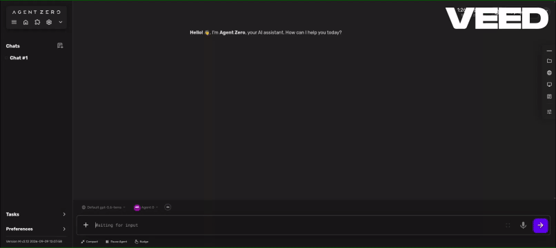
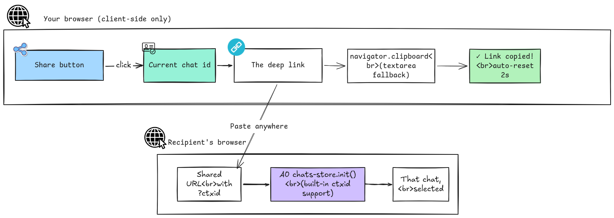
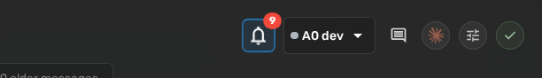

# Share Chat — Agent Zero plugin

<!-- BADGES:START (generated by the devkit — `make badges`) -->

[](https://github.com/agent-zero-plugins/agent-zero-plugin-share-chat/actions/workflows/plugin-e2e.yml) [](https://github.com/agent-zero-plugins/agent-zero-plugin-share-chat/tree/main/tests/e2e/features) [](https://github.com/agent-zero-plugins/agent-zero-plugin-share-chat/tags) [](https://github.com/agent-zero-plugins/agent-zero-plugin-share-chat/blob/main/LICENSE) [](https://github.com/agent-zero-plugins/agent-zero-plugin-share-chat/blob/main/CONTRIBUTING.md)

<!-- BADGES:END -->

> One click to share the conversation you're looking at. **Share Chat** adds a small circular share button to the top bar of the Agent Zero chat area. Clicking it copies a deep link to the currently open conversation to your clipboard, paste it into a message, a ticket, or another browser tab, and Agent Zero opens straight to that chat.

<p align="center">
  
</p>

## ✨ Features

- **One-click deep link** — copies `<your-a0-origin>/?ctxid=<chat-id>` to the clipboard, ready to paste into a message, a ticket, or another browser tab.
- **Instant confirmation** — the button flips to a green ✓ _"Link copied!"_ and reverts after ~2 seconds, so you know it worked without dismissing anything.
- **Client-side only** — the link is composed entirely in your browser. No backend, no state, no tokens, no network calls.
- **Native feel** — a `chat-top-end` extension styled like the rest of A0's toolbar controls.
- **Safe by default** — no chat selected → the button is a no-op, and the link grants no access by itself (see the access model below).

## ⚙️ How it works



The plugin only **produces** the link. The **consume** half — opening `?ctxid=` links — is a pre-existing Agent Zero capability it piggybacks on.

### Access model (honest edition)

The deep link is **not** a public share page and grants **no access by itself**:

- The recipient must be able to reach your Agent Zero instance **and** authenticate to it.
  An unauthenticated visitor hits the A0 login screen, not your conversation.
- The `ctxid` identifies a chat _within_ your instance; it is not a bearer token.
- If no chat is selected, the button is a safe no-op.

See [SECURITY.md](SECURITY.md) for the full threat model.

## 💬 Usage

Click the share control in the chat toolbar. That's the whole feature — and that's on purpose:

```
<your-a0-origin>/?ctxid=<chat-id>
```



Every behaviour has an asserted [BDD scenario](tests/e2e/features/), and [`docs/BEHAVIOUR.md`](docs/BEHAVIOUR.md) shows each as a screenshot from a passing run.

## 📦 Installation

**Plugin Hub** — once listed in the [Plugin Index](https://github.com/agent0ai/a0-plugins): **Settings → Plugins → Share Chat → Install**.

**Manual** (Zip) — build it yourself, or grab the zip from the [latest release](https://github.com/agent-zero-plugins/agent-zero-plugin-share-chat/releases/latest):

```bash
make package        # → dist/share_chat.zip
```

Then **Settings → Plugins → Install from file** → pick the zip. Or copy the plugin into your instance (`usr/plugins/share_chat/`) and reload plugins.

## 🔧 Configuration

None — by design. `default_config.yaml` declares no options, there is no config screen, no per-project and no per-agent settings. The plugin is a single declarative HTML extension (`extensions/webui/chat-top-end/share-chat.html`).

## 🛠️ Development

```bash
git clone --recurse-submodules https://github.com/agent-zero-plugins/agent-zero-plugin-share-chat
cd agent-zero-plugin-share-chat

make verify                  # BDD static gates
python -m pytest tests -q    # L1 shape suite (needs the tests/_testkit submodule)
make e2e                     # behaviour BDD on a nested disposable A0 (podman)
```

## 🧪 Test layout

| Layer         | Where                                  | What                                                       |
| ------------- | -------------------------------------- | ---------------------------------------------------------- |
| L1 shape      | `tests/component/test_plugin_shape.py` | static validator, deps/A0-API audits, dead hooks           |
| Static gates  | `make verify`                          | feature purity, honesty, traceability                      |
| Behaviour BDD | `tests/e2e/features/` + `steps/`       | control present, link identifies this chat, copy confirmed |

Specs live in [`docs/spec/`](docs/spec/) (BEH-1..11). CI runs the pyramid on every PR, including a seam-off red-proof — a scenario that passes without the plugin installed fails the build.

## ⚖️ License

Apache-2.0 — see [LICENSE](LICENSE), © Interu. Links are composed in your browser and copied to your clipboard; nothing is stored, published, or sent anywhere. Full threat model in [SECURITY.md](SECURITY.md).
