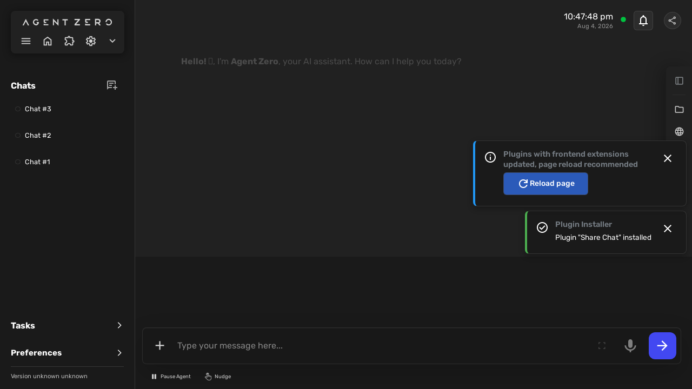
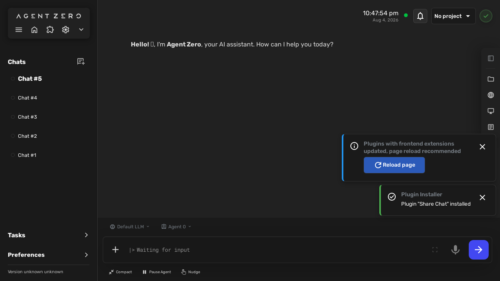

# Share Chat — behaviour

<!-- GENERATED by the devkit (`make docs`) from this plugin's own e2e run.
     Do not edit by hand: every screenshot below is the asserted end state of a
     passing BDD scenario, so it cannot show behaviour the plugin no longer has.
     Captions are the scenario titles verbatim — reword them in tests/e2e/features/. -->

Each section is one scenario from `tests/e2e/features/`, with the screenshot the
test captured at its final assertion. 3 of 3 scenarios have one.

## Sharing a chat via a deep link

### The share control is present in the chat
BEH-1

### Sharing copies a link to this chat
BEH-4, BEH-5

### Sharing confirms the link was copied
BEH-7

